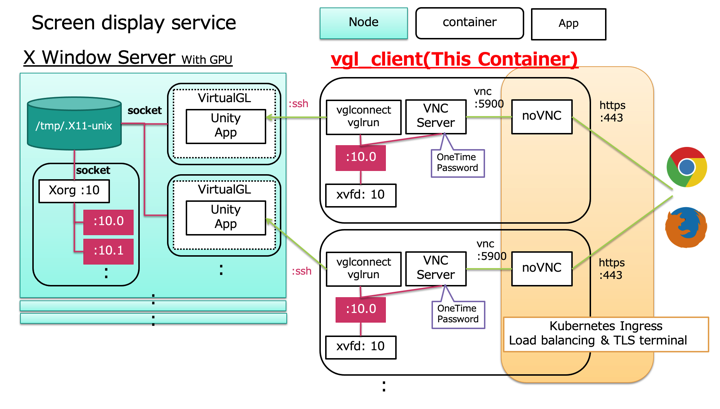
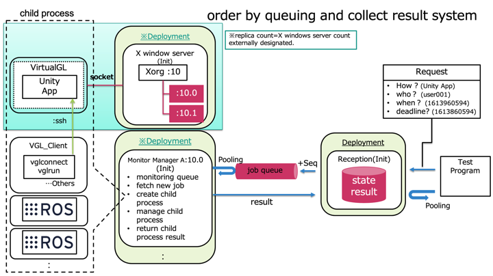

# vgl_client


vgl_client is one of the R2S2's core component. A container that provedes screen display service to a user.

## Architecture

### Overview



This container treat X Window system abstract. Therefore, it leverage each OSS modoles [VirtualGL](https://www.virtualgl.org/), [Xvfb](https://en.wikipedia.org/wiki/Xvfb), [x11vnc](https://en.wikipedia.org/wiki/X11vnc) and [noVNC](https://github.com/novnc/noVNC).  
Other R2S2's core components, can be used in conjunction with this container to provide a screen display service that secure, highly scalable and very economic.

### Relationship between apps

#### [Xvfb](https://en.wikipedia.org/wiki/Xvfb) and [VirtualGL](https://www.virtualgl.org/)

The system dose not need real screen devices.  
This makes the concurrency test with many screen output run. The app that support it is [Xvfb](https://en.wikipedia.org/wiki/Xvfb).  

[Xvfb](https://en.wikipedia.org/wiki/Xvfb) performs all graphical operations in virtual memory without showing any screen output. From the point of view of the client it acts exactly like any other X display server, serving requests.  
But Xvfb is not perfect alternative to native X window server. It dose not work in the context of OpenGL. The solution is the [VirtualGL](https://www.virtualgl.org/)!!  

[VirtualGL](https://www.virtualgl.org/) is an open source program that redirects the 3D rendering commands from Unix and Linux OpenGL applications to `3D accelerator hardware in a dedicated server` and displays the rendered output interactively to a thin client located elsewhere on the network. (Quoted from [Wikipedia](https://en.wikipedia.org/wiki/VirtualGL))  



In the R2S2 system, VirtualGL server containers having GPU connection are used as a `3D accelerator hardware in a dedicated server`. (The Node in the figure of "Screen display service") There are certain number of VirtualGL server containers on the standby to run a OpenGL App launch request from vgl_client. It is an important role of the R2S2 system to process them in order by queuing and collect the execution results.

To summarize the story so far: vgl_client does not directly run the OpenGL app, it leaves that to the VirtualGL server containers. vgl_client displays the received video stream on Xvfb.

#### [Xvfb](https://en.wikipedia.org/wiki/Xvfb) and VNC modules

Check the result rendered on the [Xvfb](https://en.wikipedia.org/wiki/Xvfb) through the network. To achieve this, we will use a combination of two VNC modules, [x11vnc](https://en.wikipedia.org/wiki/X11vnc) and [noVNC](https://github.com/novnc/noVNC).

- [x11vnc](https://en.wikipedia.org/wiki/X11vnc)
  - VNC is an implementation of the remote desktop. And x11vnc is one of its server programs.
- [noVNC](https://github.com/novnc/noVNC)
  - noVNC is both a HTML VNC client JavaScript library and an application built on top of that library. noVNC runs well in any modern browser.

And access to noVNC from the browser is handled by the load balancer and TLS termination provided by Kubernetes Ingress.

## Usage

You need to setup each environment variables.  
Furthermore, You need to specific X11 unix domain socket, when to interact other container(e.g. [FFmpeg](https://ffmpeg.org/)). Docker volume are used to link with other containers via the host PC. Like a `-v /tmp/.xvfb.rdbox.X11-unix:/tmp/.X11-unix`

And the OpenGL App corresponding to the launch command specified as VGL_APP is required to be installed in the container or machine specified by VGL_SERVER_IP. (Otherwise, you will catch a responce of command not found.)

```bash
docker run -it --rm \
  -e VGL_APP="glxgears -info" \
  -e VGL_SERVER_IP=192.168.16.154 \
  -e VGL_SERVER_PORT=54322 \
  -e VGL_DISPLAY=:10.0 \
  -e VGL_LOGO=1 \
  -e VNCPASS=passwd \
  -v /tmp/.xvfb.rdbox.X11-unix:/tmp/.X11-unix \
  -v /home/ubuntu/.ssh:/etc/secret-volume \
  --net=host \
  --name vgl-client rdbox/vgl-client:v0.0.1
```

|  item           |  types     |  description                                    |  example          |
| --------------- | ---------- | ----------------------------------------------- | ----------------- |
| VGL_APP         | string     | launch command of OpenGL App(Contains arguments)| glxgears -info    |
| VGL_SERVER_IP   | string     | Address of VirutlGL Server                      | 192.168.16.154    |
| VGL_SERVER_PORT | int        | Port number of VirutlGL Server                  | 54322             |
| VGL_DISPLAY     | string     | the X display/screen to use for 3D rendering    | :0.0              |
| VGL_LOGO        | int(0 or 1)| Disable or enable the display of a VGL logo     | 0                 |
| VNCPASS         | string     | use authentication                              | p@ssw0rd          |

## Licence

[MIT](https://github.com/rdbox-intec/repeater_for_ev3rt/blob/main/LICENSE)